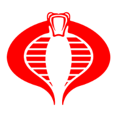

<p style="text-align:center">

</p>

# CobraCon 2023

Welcome to the CobraCon project. A registration app that lets visitors join
GI Joe or Cobra and create a shareable badge with their profile image overlaid
on the GI Joe/Cobra character of their choice.

## ⚙️ Stack

| Tech       | Use                                                                            |
| ---------- | ------------------------------------------------------------------------------ |
| .NET 8     | Serves up a Blazor Hybrid app                                                  |
| Clerk      | Handles auth with GitHub & Twitter and stores user metadata                    |
| Cloudinary | Hosts images for GI Joe characters & transforms them using user profile images |
| Supabase   | Stores data related to GI Joe characters                                       |

## 🚀 Project Structure

Inside the CobraCon project, you'll see the following folders and files:

```text
/
├── Components/
│   └── Pages/
│       └── [Razor home page]
│   └── Shared/
│       └── [Razor components & css]
├── Models
│   └── [POCO classes]
├── State
│   └── [State containers]
├── wwwroot/
│   └── [app images & JavaScript]
```

## 👀 Want to learn more?

Hit me up on [Twitter](https://twitter.com/michaeljolley).
